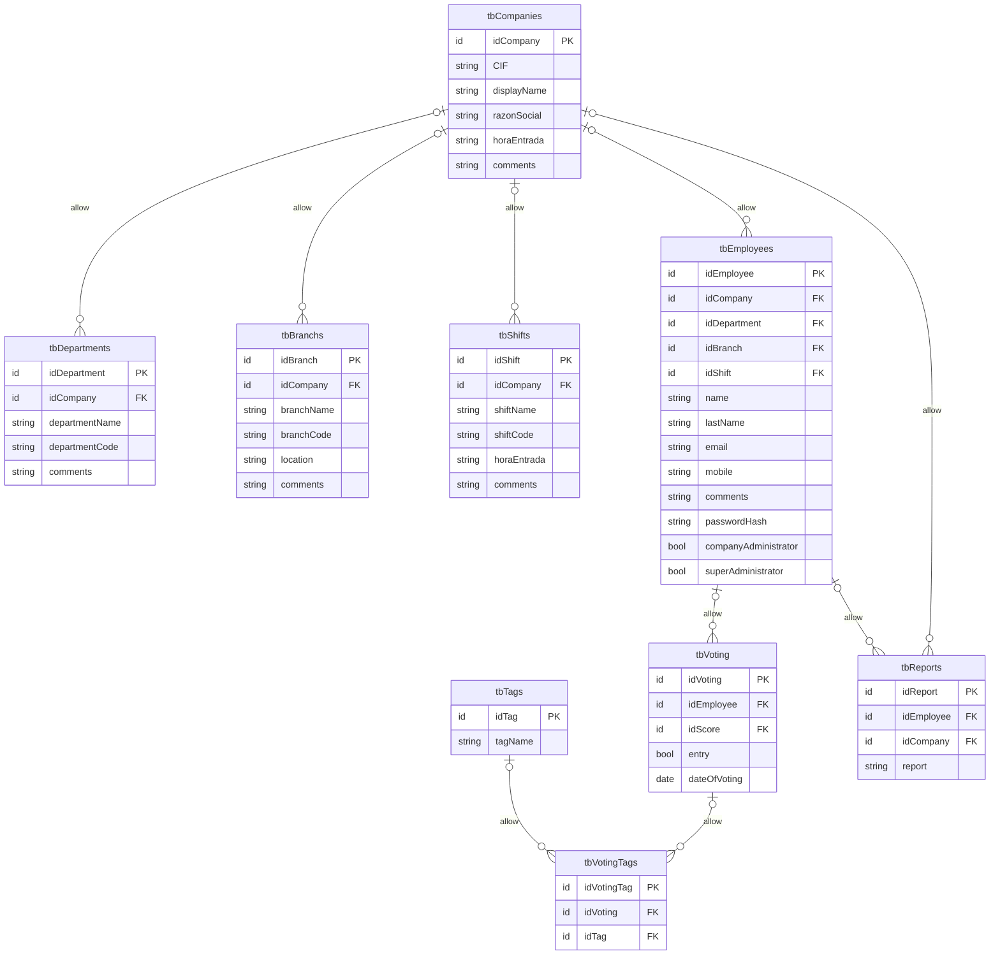

# BACK DESAFIO TRIPULACIONES

## Apuntes varios
- Repositorio privado y con licencia Creative Commons
- Funciones extra como el 'superadministrador' podemos planificarlas, y dependiendo del tiempo que tengamos:
    - No se llevan a cabo.
    - Se llevan a cabo en el back.
    - Se llevan a cabo en back y front.

## Funcionalidad del back
- Superadministrador:
    - CRUD empresas/clientes.
    - CRUD admin. empresas/clientes.
    - Puede ver todas las empresas.
- Administrador:
    - En principio es alguien del dpt. de RRHH de cada empresa.
    - Solo ve datos de su propia empresa.
    - CRUD empleados.
    - CRUD departamentos.
    - CRUD sedes.
    - CRUD turnos.
- Trabajador:
    - Rellenar formulario diario.
    - Canal comunicación RRHH (anónimo por defecto).
- Votaciones:
    - CR de votación por cada trabajador.
    - 

## Dudas
- Las etiquetas son universales, no dependen de la puntuación del 1 al 5 previa
- Los reportes a RRHH llegan solo por el dashboard, y en 2a fase, por mail.
- Notificaciones del navegador.

## Estructura SQL
Este es el esquema de la base de datos.

La base de datos tiene la siguiente carencia: a un trabajador le puedes añadir departamentos, sedes, turnos y empresas que estén vinculados a empresas distintas entre sí. Para solucionarlo, la tabla empleados tiene un trigger before insert, que comprueba que empresa, departamento, sede y turno pertenezcan a la misma empresa o sean Null. En caso contrario, devuelve error 45000.

