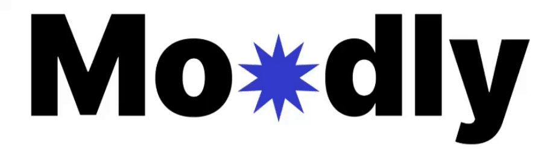

Servicio web que:
- ofrece al trabajador la posibilidad de comunicar de forma anónima lo que realmente siente, sin condicionamientos.
- ofrece al departamento de Recursos Humanos información de calidad acerca del estádo anímico de la plantilla, clasificada por departamentos, sedes, turnos, etc.

## CONTENIDO
* [DESPLIEGUE EN LOCAL](#despliegue-en-local)
* [ACCESO EN LOCAL](#acceso-en-local)
* [TECNOLOGÍAS](#tecnologías)
* [DETALLES TÉCNICOS](#detalles-técnicos-y-notas-del-proyecto)
* [ACCESO A PRODUCCIÓN](#acceso-a-producción)
* [NEXT STEPS](#next-steps)
* [COLABORADORES](#colaboradores)

## DESPLIEGUE EN LOCAL

Clonamos el repositorio en local, introduciendo en la terminal en el caso de Linux:
```git clone git@github.com:alexBasurto/tripulaciones_back.git```

... o en el caso de Windows:
```git clone https://github.com/alexBasurto/tripulaciones_back.git```

Creamos el fichero .env del back (/.env) tomando /.env.example como ejemplo.

Desde la carpeta del proyecto ejecutamos los siguientes comandos para poner en marcha el back:
```docker compose up --build```

Creamos el fichero .env del front (/client/.env) tomando '/client/.env.example' como ejemplo.

En la terminal nos posicionamos en la carpeta del front:
```cd client```

Instalamos las dependencias:
```npm install```

Ponemos en marcha el front:
```npm run dev```


## ACCESO EN LOCAL

| Usuario estándar | acceso |
| --- | --- |
| A15251 | Adm1234567 |
| A15252 | Adm1234567 |
| A15253 | Adm1234567 |

login usuario estándar: http://localhost:5173/

| Usuarios panel RRHH | acceso |
| --- | --- |
| A15248 | Adm1234567 |
| A15249 | Adm1234567 |

Login RRHH: http://localhost:5173/admin

## TECNOLOGÍAS

#### Front-end
Framework:
- React

Librerías:
- plotly.js

#### Back-end
Framework:
- Express JS

Entorno de ejecución:
- NodeJS

Librerías:
- bcrypt
- cors
- dotenv
- express
- express-session
- jsonwebtoken
- mysql2
- sequelize

## DETALLES TÉCNICOS Y NOTAS DEL PROYECTO
Acceda aquí:
[DETALLES Y NOTAS](./docu/DETALLES.md)

## ACCESO A PRODUCCIÓN

| Usuario estándar | acceso |
| --- | --- |
| A15251 | Adm1234567 |
| A15252 | Adm1234567 |
| A15253 | Adm1234567 |

login usuario estándar: https://moodly.basurto.dev/

| Usuarios panel RRHH | acceso |
| --- | --- |
| A15248 | Adm1234567 |
| A15249 | Adm1234567 |

Login RRHH: https://moodly.basurto.dev/admin

## NEXT STEPS
#### Panel RRHH (Administrador)
* Incorporar gráficos que muestren tendencias combinando departamentos, turnos y sedes.
* Alimentación masiva de usuarios desde Excel o CSV.
* Durante el alta de cada empleado, generación automática de mail con enlace para que termine de registrarse y configure su contraseña.
* Limitar cantidad de comentarios por usuario por día o por semana.
* Grabado de datos retroactivo: p.e., si un empleado cambia de departamento, sus votos antiguos se quedan en su antiguo departamento. Igualmente con turno y sede.
* Registro de jornada.
* Mantenimiento de calendario para cada departamento: registro de calendario laboral, vacaciones, bajas, etc.
* Visualizar los comentarios enviados por los trabajadores y recibir una notificación por correo diaria, con el resumen de comentarios.

#### WebApp (Usuario Estándar)

* Versión escritorio.
* Interfaz personalizable (temas, modo día/noche, etc.)
* Mensaje pop-up al usuario cuando detecte una tendencia negativa.
* Botón ‘olvidé mi contraseña’ y apartado para cambiar contraseña.


#### SuperAdministrador
* Panel de administración para el personal de Moodly donde poder dar de alta empresas. Al dar de alta empresa, daría de alta a uno o varios futuros administradores de la plataforma en la empresa cliente, a quien le llegaría un mail con el enlace para terminar el alta.

## CREADORES
#### FULL-STACK WEB DEVELOPERS
[VICTOR](https://github.com/Vtorcampos13)
[ESTHER](https://github.com/LentinulaEdode)
[ALEX](https://github.com/alexBasurto)

#### UX-UI DESIGNERS
[NAHIA](https://www.linkedin.com/in/nahia-alberdi-fdez/)
[MONXXO](https://monxxo.es/)