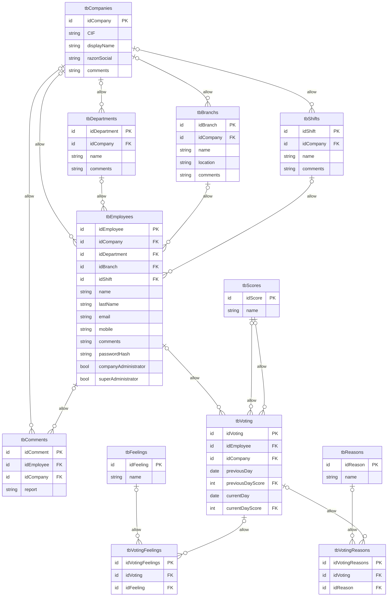

# DETALLES TÉCNICOS Y ANOTACIONES
A continuación mostramos algunos detalles técnicos que el equipo considera relevantes y una serie de notas que se tomarons durante la planificación y transcurso del proyecto.

## Funcionalidad del back
- Superadministrador:
    - CRUD empresas/clientes.
    - CRUD admin. empresas/clientes.
    - Puede ver todas las empresas.
- Administrador:
    - En principio es alguien del dpt. de RRHH de cada empresa.
    - Solo ve datos de su propia empresa.
    - CRUD empleados.
    - CRUD departamentos.
    - CRUD sedes.
    - CRUD turnos.
- Trabajador:
    - Rellenar formulario diario.
    - Canal comunicación RRHH (anónimo por defecto).
- Votaciones:
    - Create + Read de votación por cada trabajador.


## Dudas
- *Las etiquetas son universales, no dependen de la puntuación del 1 al 5 previa* -> en el caso de 'razones' si, en el caso de 'emociones', no: dependen de la valoración general dada al día.

## Plazos
- Back: día 9
- Front: días 11 - 12
    - Gráficos de data: día 13
- VPS: día 15-16

## Estructura SQL
Este es el esquema de la base de datos.

La tabla trabajadores posee un trigger before insert que comprueba que el trabajador, el departamento, el turno y la sede pertenezcan a la misma empresa. En caso contrario, devuelve un error 45000.



## Notas rápidas:

Sacar la IP del contenedor de docker de node:
```docker inspect node_tripulaciones | grep IPAddress```

## Datos inventados para mostrar algo en los gráficos:

Chat GPT:
Pregunta inicial:

```
Creame un script para ejecutar en NodeJS que genere un documento de texto con lo siguiente:

Dadas las siguientes máscaras de INSERT INTO:

INSERT INTO `tripulaciones`.`tbVoting`(`idVoting`, `idEmployee`,`idCompany`,`previousDay`,`previousDayScore`,`currentDay`,`currentDayScore`)
VALUES (<{idVoting: }>,<{idEmployee: }>,<{idCompany: }>,<{previousDay: }>,<{previousDayScore: }>,<{currentDay: }>,<{currentDayScore: }>);

INSERT INTO `tripulaciones`.`tbVotingFeelings`(`idFeeling`,`idVoting`)
VALUES (<{idFeeling: }>,<{idVoting: }>);

INSERT INTO `tripulaciones`.`tbVotingReasons`(`idVoting`,`idReason`)
VALUES (<{idVotingReasons: }>,<{idVoting: }>,<{idReason: }>);

Y teniendo en cuenta que, para tbVoting:
- idEmployee siempre tiene que ser 1
- idCompany siempre tiene que ser 1
- la fecha principal es currentDay
- previousDay es currentDay menos 1 día
- los campos fecha deben tener formato YYYY-MM-DD
- currentDayScore y previousDayScore son siempre un número entero del 1 al 5, con la siguiente frecuencia: 
        - 40% de 3 para currentDayScore, 50% para previousDayScore
        - 25% del 4 para currentDayScore, 10% para previousDayScore
        - 15% del 5 para currentDayScore, 10% para previousDayScore
        - 10% del 1 para currentDayScore, 15% para previousDayScore
        - 10% del 2 para currentDayScore, 15% para previousDayScore

Que el documento de texto contenga tantas ordenes INSERT INTO como para rellenar del 1 de enero de 2023 al 16 de enero de 2024.

Para tbVotingFeelings:
- Por cada 3 registros en tbVoting habrá uno, dos o tres asociados a tbVotingFeelings.
- idFeeling será un entero que irá del 1 al 34, apareciendo los que van del 1 al 11 el 50% de las veces

Para tbVotingReasons: 
- Por cada 3 registros en tbVoting habrá uno, dos o tres asociados a tbVotingReasons.
- idReason será un entero que irá del 1 al 12, teniendo el 1, 2, 4 y 12 el doble de probabilidades de salir

```

Pregunta 2:

```
el script va tal y como esperaba, pero quiero añadir algunas cosas:

Quiero que las probabilidades para currentDayScore y previousDayScore cambien dependiendo del mes.

Para ello, quiero que me devuelvas el script con un objeto al principio, por el cual pueda definir para cada mes desde el 2023/01 hasta 2024/01 las probabilidades para currentDayScore y para previousDayScore.
```

Pregunta 3:

```
devuelveme el objeto de forma que:
- las puntuaciones currentDayScore siempre sean un poco superiores a previousDayScore
- las puntuaciones irán mejorando, empezando en 2023/01 con alta probabilidad de 2 y llegue a 2023/08 con alta probabilidad de 3 y 4, en 2023/09 cae con alta probabilidad de 2 y va subiendo hasta 2024/01 con alta probabilidad de 4 y 5

const scoreProbabilities = {
  '2023-01': { currentDay: { '1': 0.1, '2': 0.1, '3': 0.4, '4': 0.25, '5': 0.15 }, previousDay: { '1': 0.15, '2': 0.15, '3': 0.5, '4': 0.1, '5': 0.1 } },
  // continúa...
}
```

Ubicación del sript: `/docu/sqlinvent.csj`